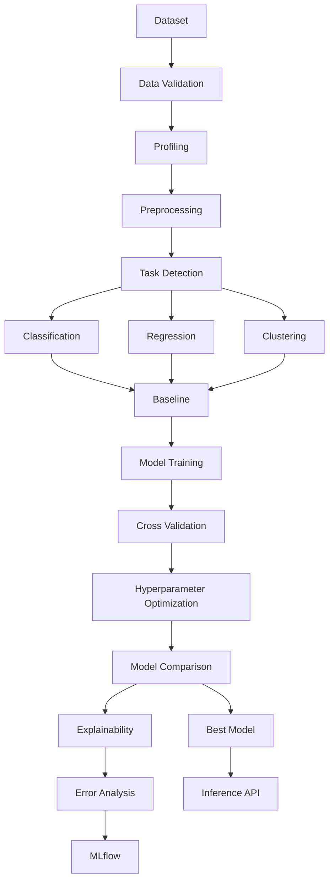

# AutoML Production Pipeline

A production-oriented AutoML project that automates dataset validation, profiling, preprocessing, task detection, model training, hyperparameter tuning, explainability, and inference for structured tabular data. The pipeline is designed for serious portfolio and internship use: modular, testable, configurable, and API-ready for real-world deployment.

## Why This Project?

Organizations often have tabular data but lack a consistent, reusable machine learning workflow. Manual model selection, ad hoc feature engineering, and missing experiment tracking make it difficult to move from raw data to production-ready predictions. This project addresses that gap by providing a modular pipeline that can profile data, detect task type, train multiple model families, compare results, explain decisions, and persist the final model in a repeatable way.

## Features

- Dataset loading for CSV, Parquet, and Excel
- Automatic dataset validation and data-quality checks
- Data profiling with schema detection and missing-value summaries
- Task detection for classification, regression, and clustering
- Preprocessing pipelines using `ColumnTransformer` and `Pipeline`
- Baseline comparison and model ranking
- Cross-validation and Optuna-based tuning
- Explainability with permutation importance and SHAP
- MLflow experiment tracking and artifact logging
- Model persistence and reusable prediction APIs
- FastAPI application and CLI entry point
- Automated tests and project configuration

## Architecture



## Repository Structure

```text
.
├── README.md
├── pyproject.toml
├── requirements.txt
├── Dockerfile
├── docker-compose.yml
├── configs/
├── data/
├── notebooks/
├── src/ml_pipeline/
├── tests/
├── reports/
├── .github/
└── .env.example
```

## Quick Start

```bash
python -m venv .venv
source .venv/bin/activate
pip install -r requirements.txt
python -m ml_pipeline profile --path data/raw/sample.csv
python -m ml_pipeline train --data data/raw/sample.csv --target target --task classification
```

## Configuration

The project uses YAML files under the `configs` directory to control tasks, tuning, and evaluation.

## Testing

```bash
pytest -q
```

## API

The FastAPI app can be launched with:

```bash
uvicorn ml_pipeline.api.main:app --reload
```

## License

MIT
